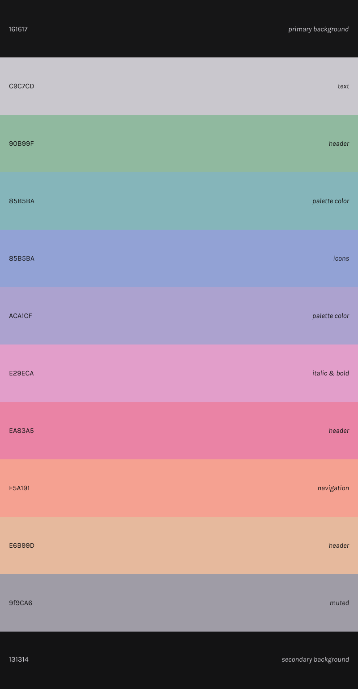

<h1 align="center">Obsidian Theme: Old World</h1>

v1.0 | created by double tilde

based on the <a href="https://github.com/dgox16/oldworld.nvim">Old World</a> theme for Neovim by dgox16

designed to be a relaxed color palette that is easy on the eyes.

## Palette

## Notes

**Fonts used:**

- Main font: Karla
- Mono font: Geist Mono

Both of these fonts are free and can be found online.

