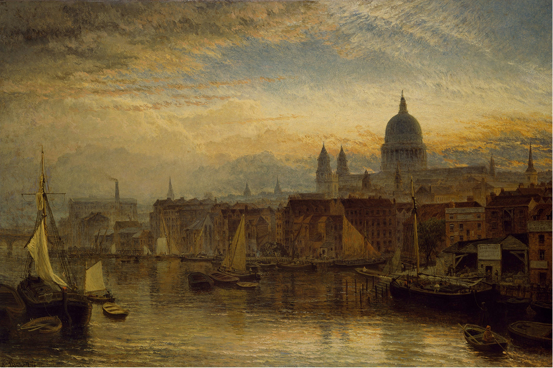

<h1 align="center">Obsidian Theme: Old World</h1>

v1.0 | Created by Double Tilde

Based on the <a href="https://github.com/dgox16/oldworld.nvim">Old World Theme</a> by dgox16

Designed to be a relaxed color palette that is easy on the eyes.

## Palette

## Notes

**Fonts used:**

- Karla
- Geist Mono

Both of these fonts are free and can be found online.

